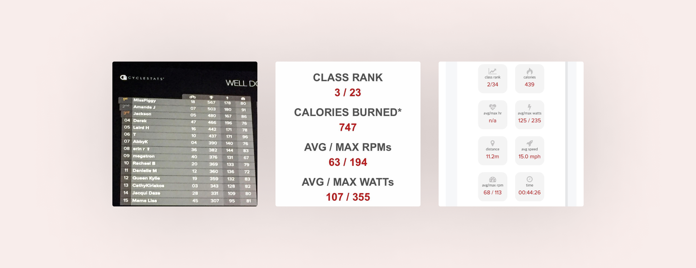
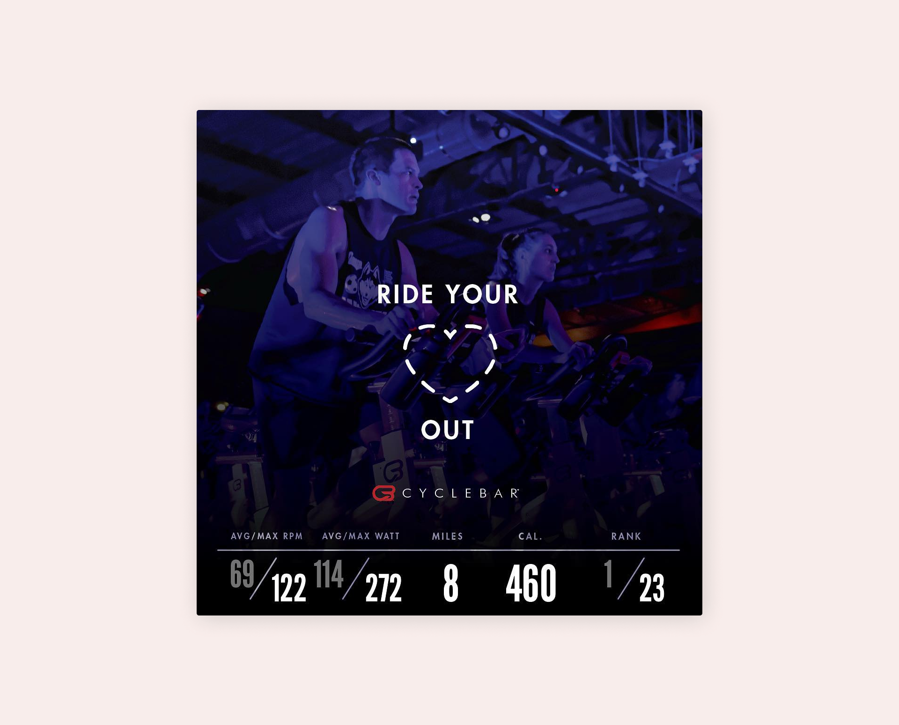
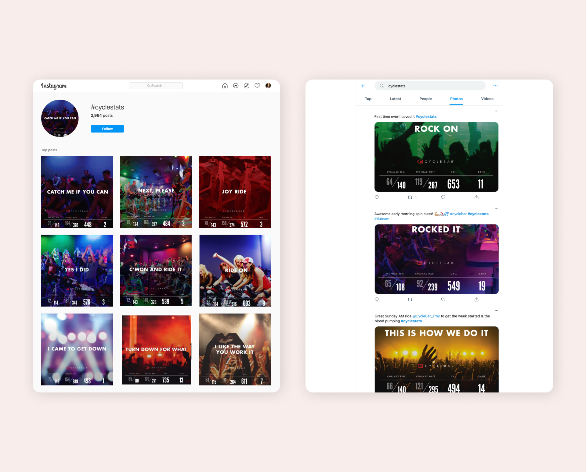

**CycleStats** were used to measure six key metrics of each rider's daily and historical performance. Results were emailed after every class to help riders track their personal fitness goals and progress.

The following metrics were included:

* Duration of ride (in MM:SS format)
* Average power (in watts)
* Maximum power (in watts; an instantaneous metric)
* Average speed (in miles per hour)
* Maximum speed (in miles per hour; an instantaneous metric)
* Average Revolutions per Minute (RPM)
* Maximum RPM (another instantaneous metric)
* Distance traveled (in miles)
* Calories burned
* CyclePoints
* Rank in class, based on **CyclePoints**

**CyclePoints** were dependent on both average metrics (watts and RPM), as well as instantaneous metrics (watts and RPM) during the ride. This took into account each individual rider’s weight, height, gender, and age. CyclePoints were used to normalize various abilities and individual characteristics of each rider in order to compare rider-to-rider performance.

For example, a 25-year old, fit male pushing 200 average watts during a ride would receive fewer CyclePoints points than a 37-year-old mother of three weighing less than 120 pounds, but pushing 150 average watts in her session.



Riders were encouraged to discuss and share their personal results after class. However, the original email didn't provide a simple way to do this. Many riders created their own solution by taking a screenshot of their results and posting the image on their social media platforms.

A new image was designed and the after class email template was updated to include direct links for sharing the image on social media.



A simplified version of how this process worked was to dynamically generate the image when the rider clicked on one of three sharing links (Facebook, Twitter, or Instagram). The rider's results were parsed from the email and passed to a script that would randomly select a phrase and background image to create a personalized and unique image just for them.

```php
// create a 100 * 30 image
$im = imagecreate(300, 300);

// set black overlay and white text
$bg = imagecolorallocate($im, 0, 0, 0);
$textcolor = imagecolorallocate($im, 255, 255, 255);

// write message at top left
imagestring($im, 5, 0, 0, 'Hello world!', $textcolor);

// output image
header('Content-type: image/png');

imagepng($im);
imagedestroy($im);
```

The image was passed directly to each social media's URL for creating a new post. This allowed users to share the image in only two steps: clicking the sharing link in their email and confirming the upload to social media instantly. Riders could also add their own message prior to uploading, if desired.

A social media campaign was promoted to encourage users to share their personalized image using `#cyclestats`. Those who used the hashtag to share their image were entered into a weekly drawing for CycleBar merchandise.



The campaign was a huge success with around 26,000 images generated and over 3,000 shares on social media.
