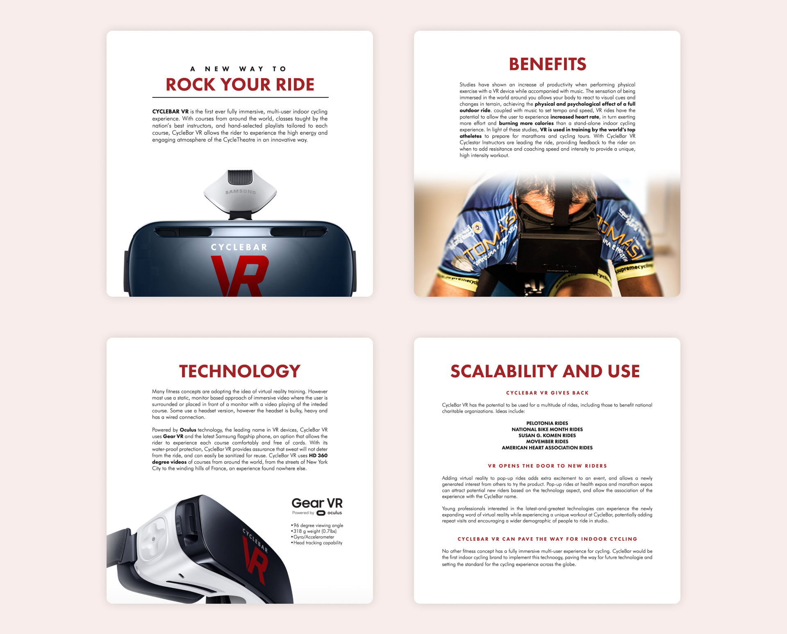

**CycleBar VR** was a concept to use virtual reality to create an immersive, multi-user indoor cycling experience.

With courses from around the world, classes taught by the nation's best instructors, and hand-selected playlists tailored to each course, CycleBar VR would allow the rider to experience the high energy and engaging atmosphere of the CycleTheatre in an innovative way.

The concept was tested on real users in the studio using Samsung Gear VR headsets. Further user research was discontinued due to concerns of hardware overheating and lack of VR content at the time.
