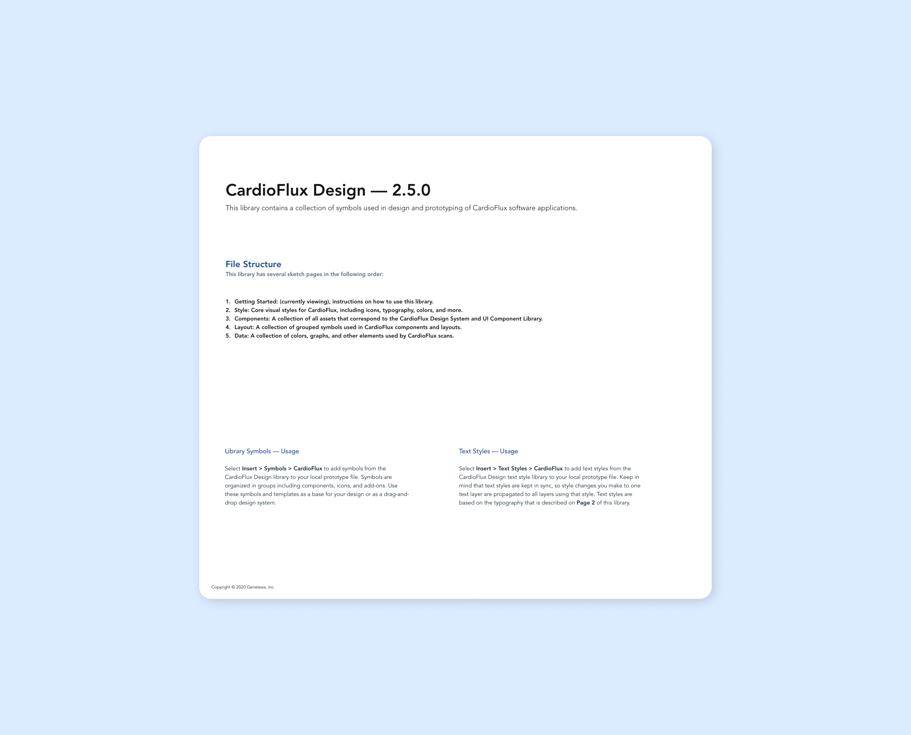
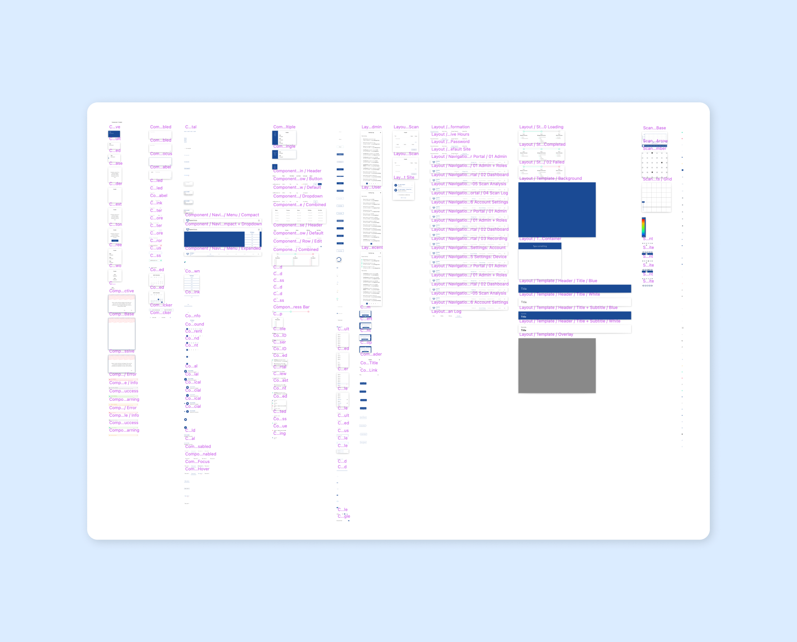
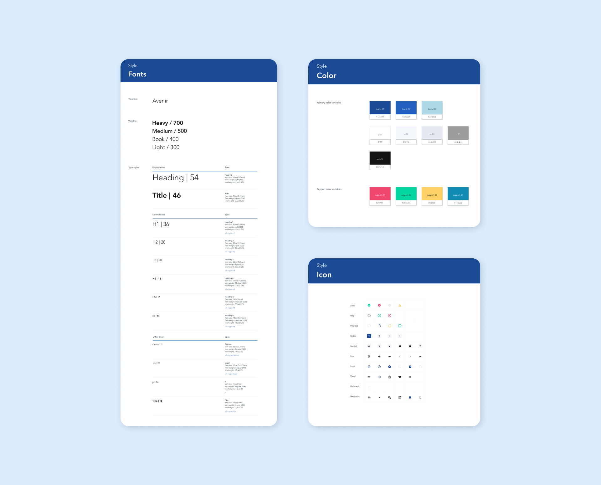
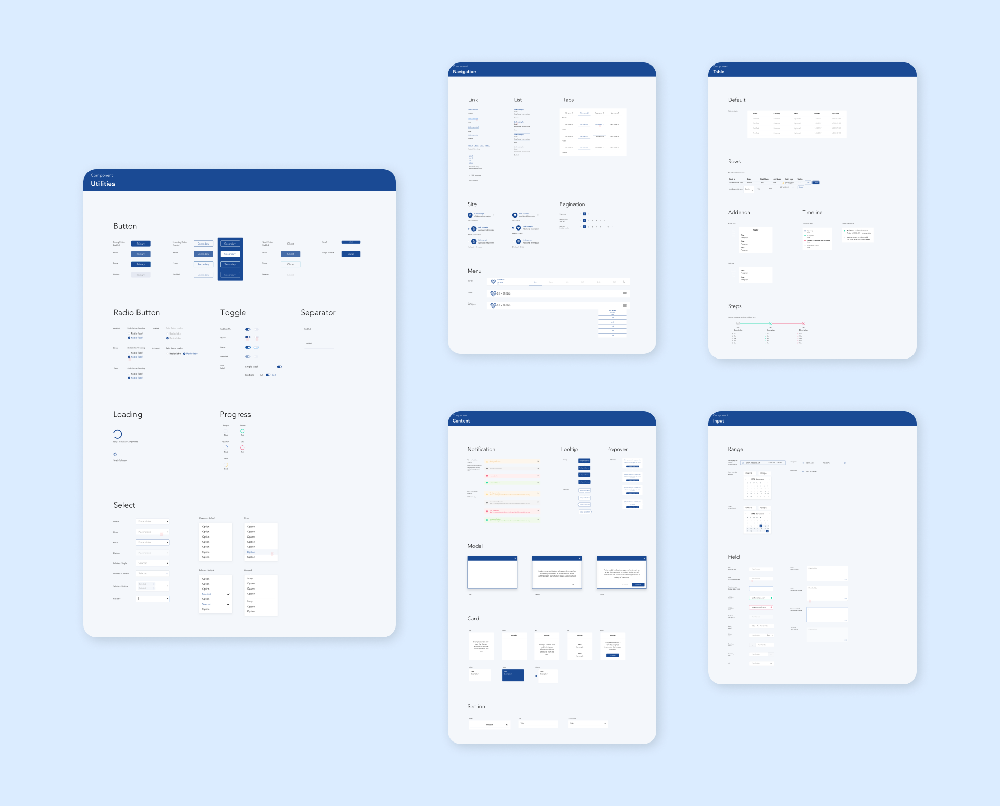
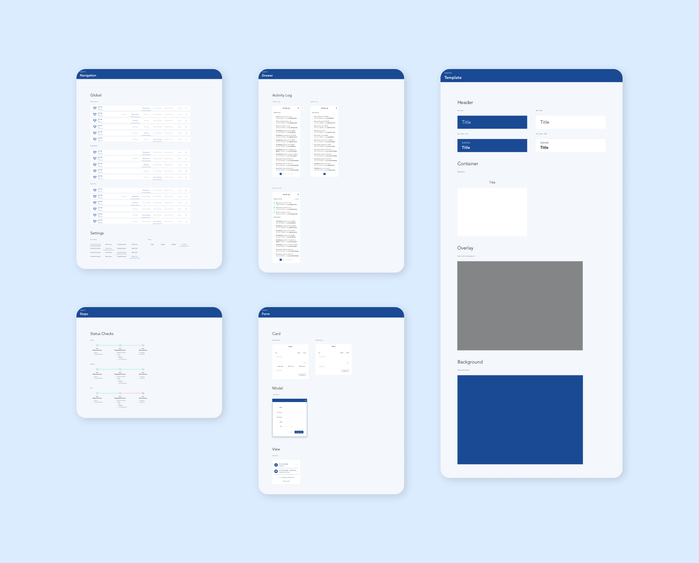
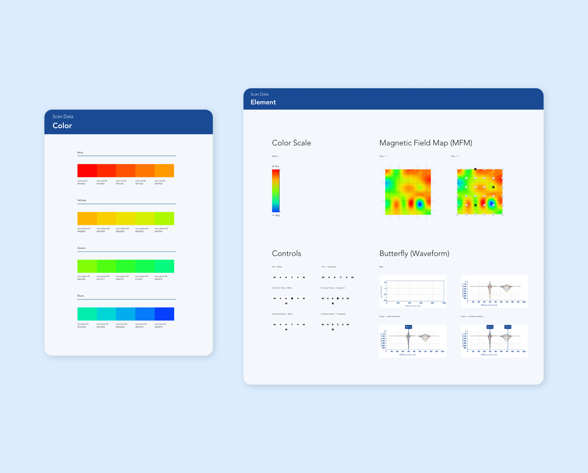

**CardioFlux Design System** was created to organize existing Genetesis brand assets and quickly iterate on new design concepts for CardioFlux software applications. The entire library was built out over the course of two years.

## Release Notes

Changes to the library were performed during two-week sprints. At the end of each sprint, the updated library would be released with documented changes and tracked through version control. This allowed us to review our progress over time and have access to prior versions when needed.

For a deeper look into how this library was tracked through version control, visit my post on [Sketch to GitHub](/sketch-to-git-hub).

## Symbols

The Sketch library contained color palettes, iconography, components, and layouts. Over 250 symbols were created for use in rapid design and development prototyping.

## Components

Design components were updated in Sketch and tested in application prototypes to collect user feedback.

Once approved, each component was recreated by the software team in [Storybook](https://storybook.js.org/) for use in our shared UI library. Documentation and prototype files were provided with Vue.js templates and component CSS.

CardioFlux Design was later ported to Figma for ease of sharing designs cross-platform between myself and new designers on the team.
