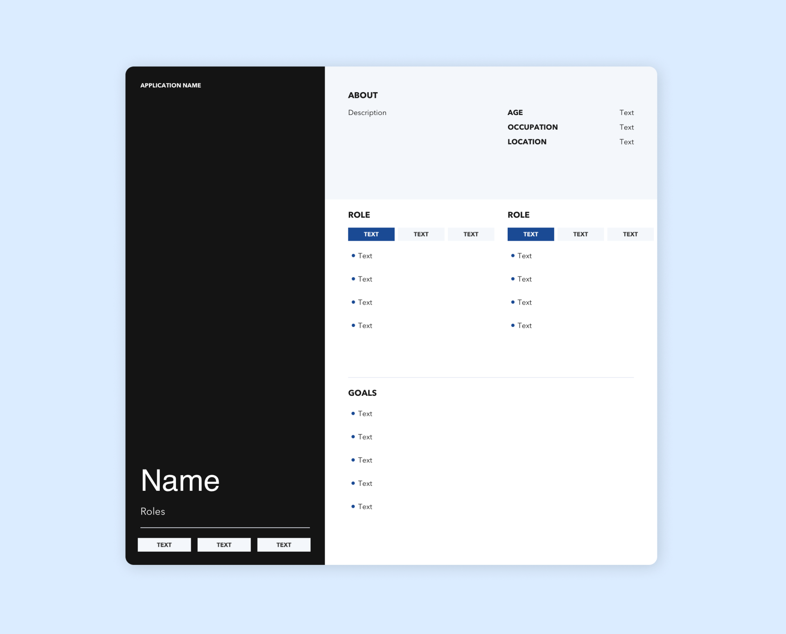
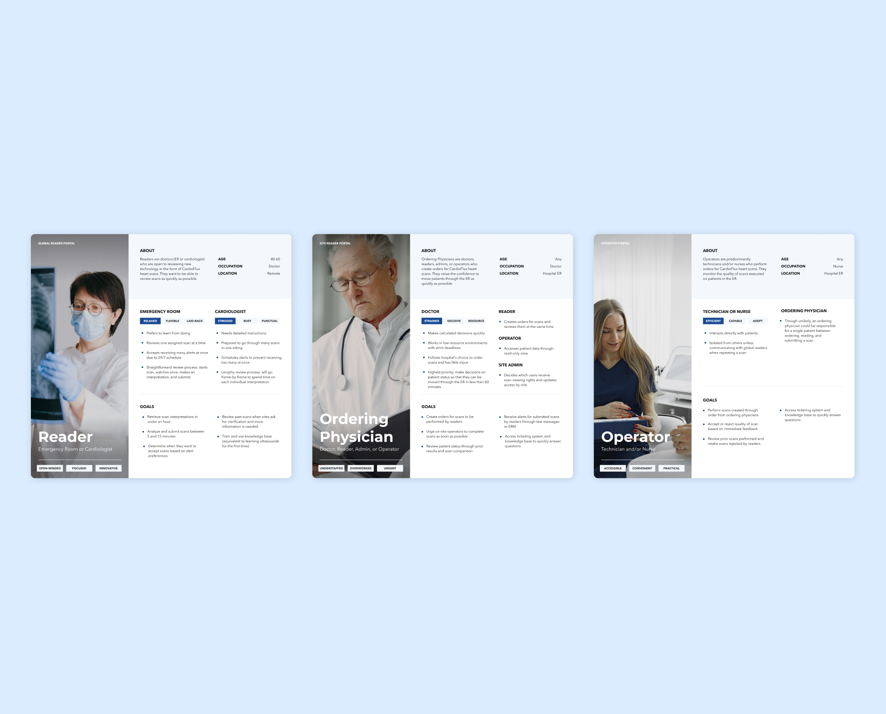

**User Personas** were used to identify users for each CardioFlux application.

A single Sketch template was created to consolidate layout and design. This allowed each persona to maintain its own individual context without being affected by layout changes.

## Template

The persona template included the following information:

* CardioFlux Application Name
* Persona Name
* Roles (used to trigger feature flags)
* Characteristics (such as open-minded, rushed, practical)
* Short bio including estimated age, occupation, and location within a hospital
* Expanded roles broken down by application (if applicable)
* User Goals

## Screens

Three initial personas were created prior to each application's development cycle.

**Readers**: Doctors (ER or cardiologist) who are open to reviewing new technology. They want to be able to understand the application with minimal training and review scans as quickly as possible.

**Ordering Physicians**: Doctors, readers, admins, or operators who create orders for a scan. They value the confidence to move patients through the ER and rely on being able to view data from each scan.

**Operators**: Technicians and/or nurses who perform orders for a scan. They monitor the quality of scans executed on patients in the ER.
