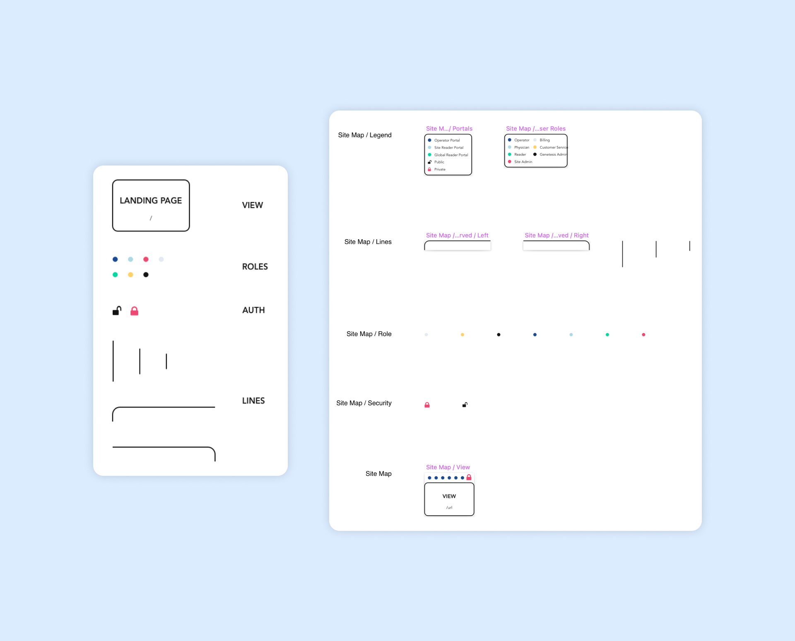
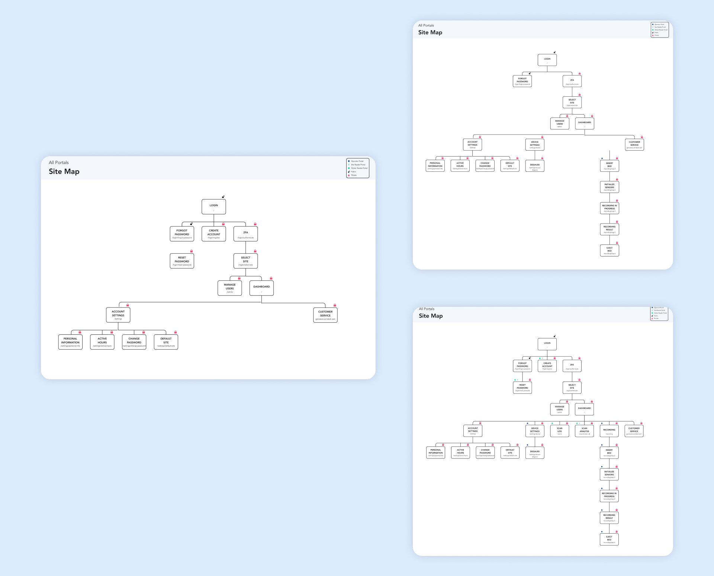

**Site Maps** were used to view existing and upcoming user views for each CardioFlux application.

## Symbols

A Sketch library was created to provide site map consistency while allowing customized information for each view in an application. The following options were included:

* Name of view with URL
* User roles (toggled by feature flags)
* Authorization (private or public view)

Along with helper tools in the form of horizontal and vertical lines.

## Screens

