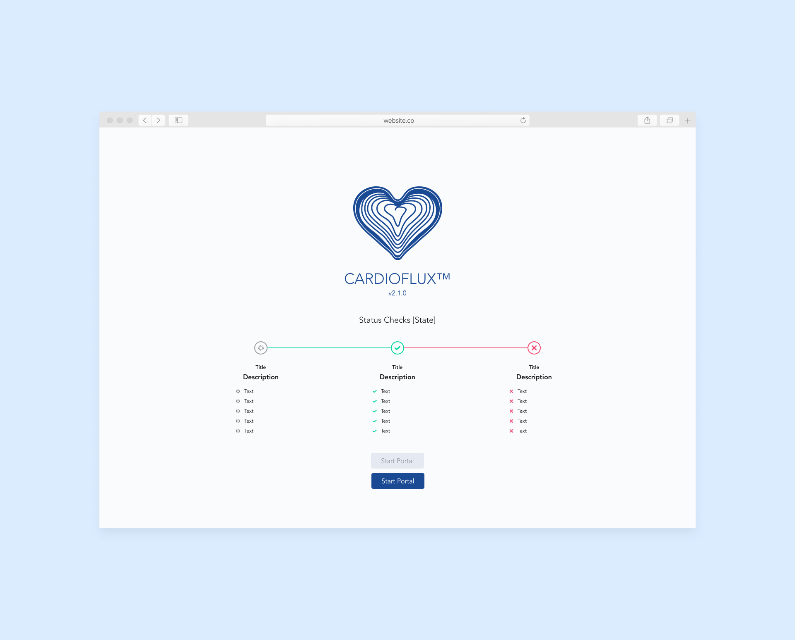
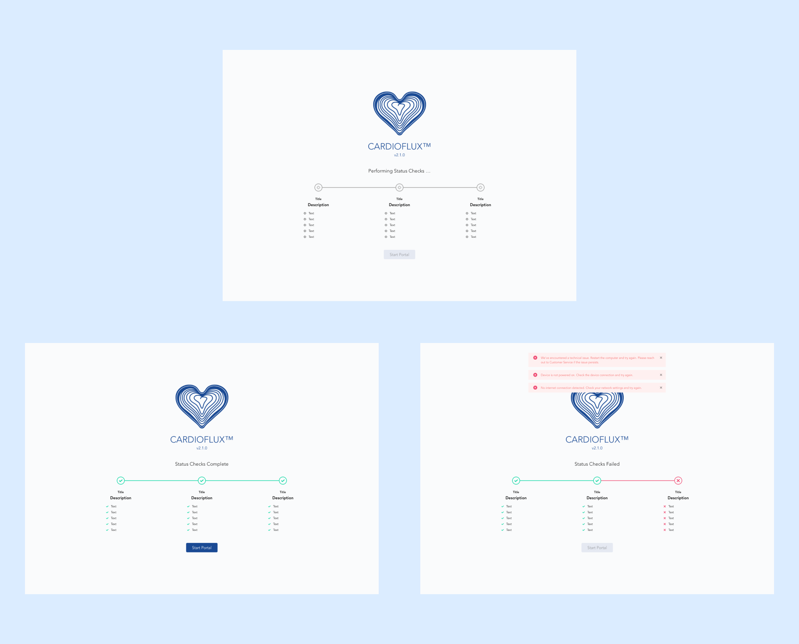
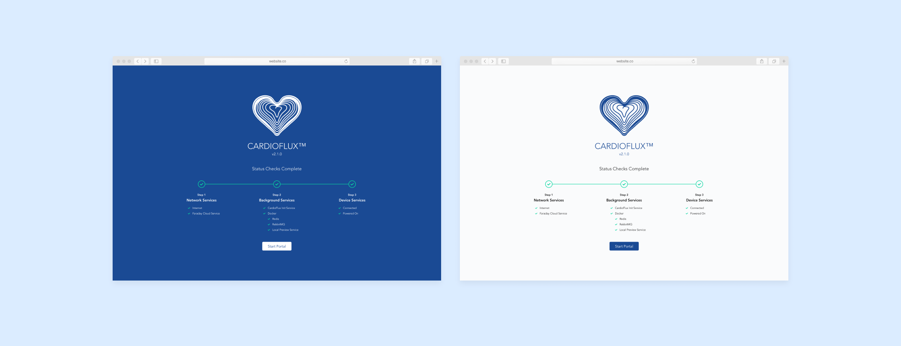

**CardioFlux Status Checks** informed users of existing errors prior to starting a CardioFlux device.

The status check view was designed based on feedback collected from user pain points. Each point was reviewed prior to implementation and consolidated into steps based on priority and severity.

Local tests were included for developers to recreate common scenarios in a controlled environment. Using this information, we were able to better predict potential blockers for users and better inform the team of possible solutions.

The application would first check for the most common (and solvable) errors. These included an active internet connection and uptime of our cloud server. If either was unable to be reached, the status check would fail and display helpful information on fixing either error.

The second set of checks included services running on external hardware connected to the device. Failure of any of these would often result in the need for a restart of the connected component or reaching out to customer service for additional troubleshooting.

The final set checked the CardioFlux device itself for internal issues. Any error occurring at this stage would result in the device needing to be manually inspection prior to use.

## Template

## States

## Dark and Light Modes

