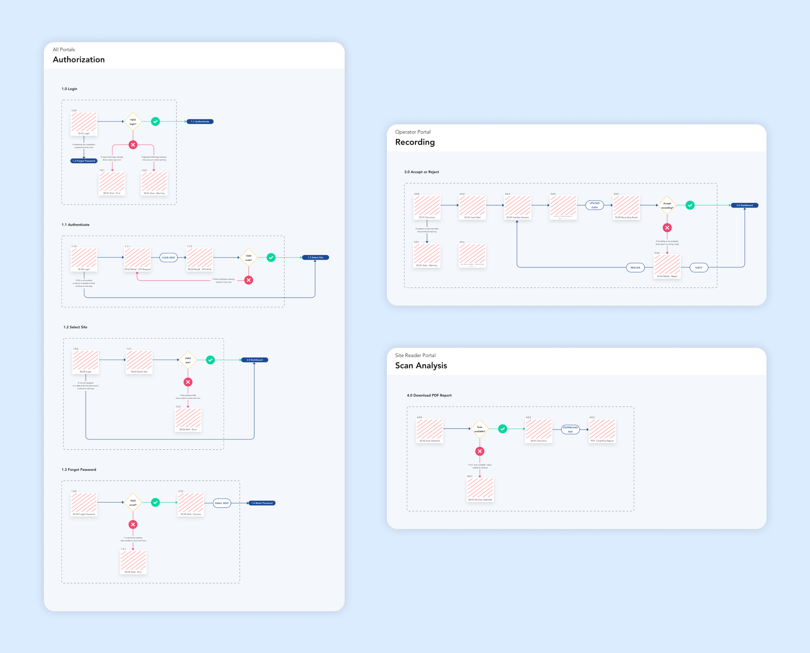

**User Flows** were used to identify success and failure paths for each CardioFlux application.

## Symbols

A Sketch library was created to document flows for each CardioFlux application. The following symbols were included:

* Image of screen displayed during user flow
* Action of user (often clicking on a specific element to progress)
* End goal of the user
* Questions in the form of conditional checks (ie. does the user have an account? is the user logged in?)
* Response from conditional check
* Explanation for user failure to reach goal

## Screens

